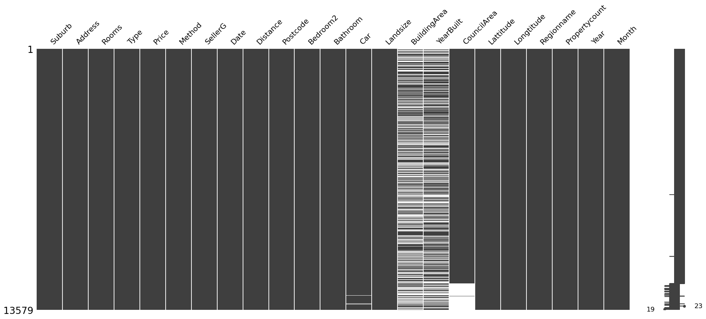
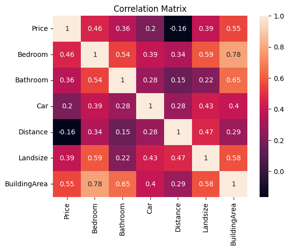

# Data, Dilemmas, and Discoveries: Melbourne Real Estate's Lessons on Modelling

## **Introduction**
Have you ever wondered how real estate prices are determined?  While helping a friend search for a home, I became fascinated by this question. As a data science student, I saw an opportunity to apply my newly acquired skills.  Regression analysis, data cleaning, and exploratory data analysis (EDA) were all concepts I was actively learning.  This project allowed me to combine these skills in a real-world context.

By leveraging a dataset from Kaggle, I could explore how these techniques work with real estate data. This included cleaning and analyzing the data, building a regression model to understand the relationship between price and property features, and potentially incorporating time series analysis to examine market trends. Finally, I aimed to showcase the findings in a presentable format using a tool like Power BI.

Ultimately, my goals were twofold: to gain a deeper understanding of how price relates to property features through regression analysis, and to explore the impact of market fluctuations over time using time series analysis. Working with real data provided a valuable opportunity to solidify my knowledge and gain practical experience applying these concepts.

## **Notebooks**
**Want to see the code behind this project?** Want to see how the analysis was performed?  The code for this project, including the data manipulation, analysis, and modeling techniques, is located in the `05_Analysis_Reporting` folder. Check out the notebooks:

1. [**Cleaning Notebook**](./05_Analysis_Reporting/Notebooks/01_Data_Cleaning.ipynb)
2. [**EDA Notebook**](./05_Analysis_Reporting/Notebooks/02_Exploratory_Data_Analysis.ipynb)
3. [**Regression Modelling Notebook**](./05_Analysis_Reporting/Notebooks/03_Regression_Modelling.ipynb)
4. [**Time Series Notebook**](./05_Analysis_Reporting/Notebooks/04_Time_Series.ipynb)

**You'll also find the Power BI dashboard in the same folder.**

## **Executive Summary**

### **Data Gathering**
I used the Melbourne Housing Snapshot dataset ([link to the dataset](https://www.kaggle.com/datasets/dansbecker/melbourne-housing-snapshot)), which records the Melbourne Housing Market from early 2016 to the end of 2017. The .csv format allowed for seamless analysis within my notebook using the pandas library.

The dataset includes the following columns:

| Column | Description |
|--------|-------------|
| `Suburb` | Name of the suburb |
| `Address` | Full address of the property |
| `Rooms` | Number of rooms in the property |
| `Price` | Price of the property in Australian dollars |
| `Method` | Sale method:   <ul><li>`S`: Property sold</li><li>`SP`: Property sold prior</li><li>`PI`: Property passed in</li><li>`VB`: Vendor bid</li><li>`SA`: Sold after auction</li> |
| `Type` | Type of property:   <ul><li>`h`: House, cottage, villa, semi, terrace</li><li>`u`: Unit, duplex</li><li>`t`: Townhouse</li></ul> |
| `SellerG` | Real Estate Agent involved in the sale |
| `Date` | Date when the property was sold |
| `Month` | Month when the property was sold |
| `Year` | Year when the property was sold |
| `Distance` | Distance from CBD (Melbourne downtown) in kilometres |
| `Regionname` | General region (West, North West, North, North East, etc.) |
| `Propertycount` | Number of properties that exist in the suburb |
| `Bedroom2` | Number of bedrooms (from a different source) |
| `Bathroom` | Number of bathrooms |
| `Car` | Number of car spots |
| `Landsize` | Size of the land in square metres |
| `BuildingArea` | Size of the building in square metres |
| `YearBuilt` | Year the property was built |
| `CouncilArea` | Governing council for the area |
| `Latitude` | Latitude of the property |
| `Longitude` | Longitude of the property |
___

### **Data Cleaning**
My project began by importing the dataset for initial inspection and data cleaning. I immediately removed any duplicates and extracted month, and year into separate columns from the existing date column, for potential use as features in the regression modelling stage. A preliminary inspection using the `.describe()` and `.isna().sum()` functions revealed several issues within the data.

**Data Wrangling**

Initial data inspection revealed inconsistencies, numerous missing values, and outliers that significantly impacted data quality. To prepare the data for analysis, I employed various data wrangling techniques, including:
* Addressing  inconsistencies in room features to ensure accurate representation.
*  Handling missing values in 'Bathroom', 'Car', 'BuildingArea', and 'CouncilArea' using a combination of median imputation, data matching, and a  predictive model.
* Identifying and addressing outliers in 'Price', 'Landsize', and 'BuildingArea' using the IQR method for improved distribution and model performance. 

**1. Inconsistent Room Data:**
* **Problem:** Two columns ('Rooms' and 'Bedroom2') contained room data with occasional discrepancies.
* **Solution:**  I created a function, `effective_bedrooms`, to compare both columns and select the lower value, ensuring a conservative estimate. This resulted in a new 'Bedroom' column, and 'Rooms' and 'Bedroom2' were dropped.

**2. Properties with Zero Bathrooms:**
* **Problem:** The 'Bathroom' column had a minimum value of zero, which is implausible.
* **Solution:**  Entries with zero bathrooms were identified. After the manual verification of errors, the zeros were replaced with the median value (justified by the right-skewed distribution).

**3. Missing Values:**
* **Car:** 
    * **Problem:** 62 missing values in the 'Car' column.
    * **Solution:**  Median imputation was used due to the relatively small number of missing values and the right-skewed distribution.

* **BuildingArea:**
    * **Problem:**  Significant missing data (approximately 53%). 
    * **Solution:** Imputation using a predictive model will be performed later in a dedicated step. This requires the rest of the dataset to be cleaned first.

* **YearBuilt:**
    * **Problem:** Missing values (approximately 40%) and inconsistencies in existing data.
    * **Solution:** After considering the impact of removing erroneous entries, this feature was dropped as its potential importance for predicting 'Price' did not justify the effort.

* **CouncilArea:**
   * **Problem:** Missing values in the 'CouncilArea' column.
   * **Solution:**  I developed a function, `fill_councilarea`, to match properties based on 'Suburb', 'Postcode', 'Regionname', and 'Propertycount'. When a match with a non-null 'CouncilArea' was found, that value was used to fill in the missing data.

**Updated Data:**
After dealing with those issues this is what our data looked like:

**Note:** Prediction and imputation of 'BuildingArea' will be addressed in a subsequent step. 'YearBuilt' has been dropped.

#### Handling Outliers

While it's often preferable to retain all data points, specific circumstances warranted outlier handling in this project. Before proceeding, I identified and corrected potential outliers for each quantitative variable, ensuring data integrity.

**Initial Assessment:**
Boxplots of the quantitative features revealed the expected right-skewed distribution typical of real estate data. 

**Addressing Outliers:**

1. **Zero Landsize for Units:**
    * **Problem:** Units should not have land size.
    * **Solution:** Replaced 'Landsize' values with 0 (more appropriate for imputing later) for properties listed as units. A binary indicator variable was created to distinguish units for the model.

2. **Zero Building Area:**
    * **Problem:**  Implausible zero values in the 'BuildingArea' feature.
    * **Solution:** Replaced zeros in 'BuildingArea' with NaN for later imputation using a predictive model.

3. **General Outlier Removal:**
   * **Problem:** Skewness in quantitative features could hinder modelling. 
   * **Solution:**  Outliers in 'Price', 'Landsize', and 'BuildingArea' were removed using the IQR method. This aimed to reduce skewness and improve model performance. 'Price' was targeted as the key response variable, 'Landsize' due to its extreme skew, and 'BuildingArea' to enhance the accuracy of the planned imputation model.
  
**Result:**

The revised distributions for 'Price', 'Landsize', and 'BuildingArea' exhibit less skewness. The resulting data loss (approximately 7.05%) was considered a worthwhile trade-off for the potential modelling benefits.

#### 'BuildingArea' Imputation

**Pre-Modelling Analysis**
Before fitting a predictive model, an initial analysis was conducted to guide model selection.

Observations of non-linear relationships between 'BuildingArea' and other features, along with the substantial number of missing values (6166), suggested that a non-linear model capable of handling missing data would be optimal.

**Model Selection and Feature Engineering**

Careful consideration was given to model selection, as many options exist. After testing linear models with feature engineering (e.g., transformations, scaling, addressing multicollinearity), superior performance was achieved using a non-linear Random Forest regressor. Here's why:

* **Ensemble Power:**  Random Forests aggregate predictions from multiple decision trees, improving accuracy and handling non-linearity.
* **Decision Tree Adaptability:** Decision trees excel at modelling non-linear data without strict assumptions or transformations. They also handle multicollinearity well.
* **Overfitting Mitigation:** Random Forests reduce overfitting by averaging predictions from diverse trees, a key benefit for non-linear data.
* **Mixed Data Handling:** Random Forests work seamlessly with both numerical and categorical features, minimizing preprocessing needs.

**Addressing Feature Explosion**
To address the large number of features created by dummy variables of categorical variables, we employed Recursive Feature Elimination with Cross-Validation (RFECV). This reduced the feature count from 831 to an optimal 39, minimizing overfitting risk. 

**Hyperparameter Tuning and Evaluation**
GridSearchCV was used to fine-tune the Random Forest model's hyperparameters, further optimizing performance using the selected features. This yielded training \(R^2\) of 0.7363 and test \(R^2\) of 0.6246. While some overfitting is evident, the difference is not extreme. Additionally, RMSE values (training: 26.9028, test: 32.4254) are reasonable for the 'BuildingArea' range. This configuration outperformed other tested models.

**Imputation and Completion**
The optimized model was used to predict missing 'BuildingArea' values, successfully imputing 6166 entries and creating a fully cleaned dataset. This dataset was exported as a CSV for subsequent analysis.

### **Exploratory Data Analysis (EDA)**

#### Analysis

EDA provided insights crucial for modelling and data preparation decisions. Key findings include:

**Histograms:**
* Most features exhibit right-skewness, suggesting a potential benefit from normalization (transformation) for linear models. 
* 'Landsize' and 'BuildingArea' (continuous quantitative variables) may require scaling.

**Boxplots:**
* No extreme outliers were detected in the current data, confirming the effectiveness of previous outlier handling.

**Scatter Plots:**
* Predominantly non-linear relationships exist between quantitative features and the target variable ('Price'). This indicates the suitability of either transformed linear models or inherently non-linear models.

**Correlation Matrix:**
* Expected positive correlations between most quantitative features and 'Price' were observed. 
* Interestingly, 'Distance' (to downtown) and 'Price' showed a weaker-than-expected correlation, implying a potentially complex relationship worth further investigation.

Here's a revised version of your conclusion that aims to be more concise, focused on key takeaways, and less repetitive:

**EDA Conclusion**

EDA revealed crucial characteristics of the dataset that will guide subsequent modelling and data preparation steps:

* **Non-linearity:**  The observed non-linear relationships suggest that feature engineering (e.g., transformations, scaling, polynomial features, interaction terms) might be necessary to enhance the fit of linear models. If these techniques prove insufficient, non-linear models may be a more suitable approach.
* **Multicollinearity:**  The presence of multicollinearity warrants careful handling (e.g., through feature selection, dimensionality reduction, or regularization) to improve model stability.

The observed non-linear relationships suggest that feature engineering techniques (e.g., transformations, scaling, etc.) might be necessary to enhance the fit of linear models. If these techniques prove insufficient, non-linear models may be a more suitable approach.

### **Regression Modelling**

EDA provided crucial insights for informed decision-making throughout the modelling process, enabling effective feature engineering and guiding model selection to understand the factors influencing price (inference). This is outlined below:

#### Feature Engineering

Given the non-linear relationships observed during EDA, feature engineering was explored to improve the fit of linear regression models. Techniques considered included:

* **Transformation:**  Applying mathematical functions (e.g., logarithm, square root) to variables to alter their distribution and potentially enhance linearity.
* **Scaling:**  Rescaling continuous variables to have comparable ranges, ensuring that features with different magnitudes have proportionate influence within the model.
* **Multicollinearity Handling:**  Identifying highly correlated features using techniques such as Variance Inflation Factor (VIF).  Potential remedies include removing redundant features, combining features through dimensionality reduction, or using regularization within the models.
* **Polynomial Features:**  Creating new features by combining existing ones through powers (e.g., squaring or cubing) to capture more complex non-linear patterns. 
* **Interaction Features:**  Generating features that represent the combined effect of two or more original features, potentially uncovering relationships not evident in individual features.

However, diagnostic tests (JB, BP) indicated persistent issues with normality and heteroskedasticity, limiting the effectiveness of linear models even with feature engineering.

**Transition to Random Forest**

The focus shifted to non-linear models, specifically Random Forest, for the following reasons:

* **Handles Non-linearity:** Its decision tree structure intrinsically captures non-linear relationships without transformation or scaling.
* **Robust to Multicollinearity:** Random Forest's feature sampling at each node reduces the impact of highly correlated features.
* **Preserves Interpretability:** While PCA offers dimension reduction, it can obscure feature-level importance, which is crucial for understanding the drivers of real estate pricing (our project's goal).

**Note:**  Specific feature engineering techniques like transformation and scaling were not necessary for Random Forest due to its inherent strengths in handling these data characteristics. 

#### Random Forest Modelling

**Motivation:**
After feature engineering failed to sufficiently improve the fit of linear models (due to inherent data non-linearity), I shifted my focus to a non-linear machine learning model, specifically Random Forest. Key reasons:

* **Handles Non-linearity:** Random Forests are well-suited to complex, non-linear data patterns.
* **Inference Capability:** The model allows us to examine feature importance, crucial for our goal of understanding price drivers. 

**Feature Selection:** 
Recursive Feature Elimination with Cross-Validation (RFECV) was employed to identify the optimal feature subset for price prediction, aiming to reduce overfitting.

**Unexpected Results:**
RFECV indicated a large optimal feature set and yielded high cross-validation mean squared error (MSE). Subsequent model fitting, even with GridSearch hyperparameter tuning, resulted in overfitting (high R-squared, high RMSE, MSE, MAE). This was surprising given Random Forest's success in predicting 'BuildingArea'.

**Potential Explanations and Next Steps** 

1. **Model Suitability:**  While Random Forest is robust, maybe another non-linear model would be more appropriate for this specific dataset and target variable (price).  Expanding the explored models (e.g., XGBoost, LightGBM, or neural networks) could be beneficial.

2. **Data Quality:** Issues with the original data collection or scraping process may be impacting model performance. If possible, verifying the data source's reliability and investigating potential inconsistencies would be valuable.

3. **Unexplored Factors:**  External factors, not reflected in the current dataset, could significantly influence property prices.  Exploring the potential for incorporating additional data sources (e.g., economic indicators, neighbourhood demographics, etc.) might improve model fit.

**Conclusion**
Further investigation is needed to achieve a satisfactory model for price prediction. This highlights the iterative nature of data science and the importance of considering data quality and model selection carefully.

### **Time Series**

**Motivation** 
The availability of sale dates and prices enabled a time series analysis to investigate trends and potential seasonality in the Melbourne housing market.

**Data Preparation**
* **Data Aggregation:**  To address multiple sales on the same date, the dataset was grouped by date and the average sale price was calculated for each day.
* **Time Series Setup:** A rolling 7-day average of prices was used to visualize price trends over time. 

**Moving Average Plot**

#### **Moving Average Analysis (Key Observations and Insights)**

* **Initial Trend:** An initial period of stable prices followed by an upward trend as sales volume increased.
* **Market Dynamics:** A dip in both price and volume suggested a potential market correction.
* **Rolling Average:** The 7-day rolling average confirmed a general upward trend in housing prices.
* **Seasonality:** Possible seasonal patterns were observed, with speculation about decreased activity during specific months.

**In-Depth Analysis (Research and Context)**

* **Market Correction:**  The initial "crash" perception was revised to a market correction due to overheating, likely influenced by:
    * **Economic Growth:** Melbourne's strong economy and low unemployment in 2016-17 boosted housing demand.
    * **Foreign Investment:** Influx of foreign investment contributed to rising prices.
    * **Government Intervention:**  Policies aimed at curbing foreign investment likely contributed to the correction.

* **Seasonal Patterns:**  Potential seasonal trends were linked to typical Melbourne real estate market cycles:
    * **Summer (Dec-Feb):**  Initial slowdown followed by increased activity.
    * **Autumn (Mar-May):**  Generally favorable for sales.
    * **Winter (Jun-Aug):**  Typical slowdown.
    * **Spring (Sep-Nov):**  Peak activity with increased listings and sales.

**Further Considerations and Future Directions**

* **Multifaceted Correction:**  The market correction likely resulted from a combination of factors, including government intervention and natural market adjustments.
* **Underquoting Legislation:**  Regulations targeting underquoting aimed to improve market transparency and reduce artificially inflated prices.
* **Taxation and Investment Policies:**   Measures like increased taxation on foreign investors were designed to moderate investment-driven price surges.
* **Forecasting:**  Additional time series models could be explored to forecast prices beyond the dataset's end date (October 2017).

**Limitations:** The analysis is constrained by the dataset's end date.  More recent data would be needed to fully assess the impact of government policies and long-term market trends.

#### **Exploring Exponential Smoothing**

* **Motivation:** The intriguing end-of-dataset market dynamics motivated the exploration of the Holt-Winters exponential smoothing model to capture recent trends and seasonality.

* **Data Preparation Challenge:**  Inconsistent date frequencies in the original dataset posed a challenge for time series analysis.
    * **Resampling:** Resampling to a bi-weekly frequency was attempted to establish consistency. While this reduced data scarcity, missing entries remained due to large gaps in the original data. 
    * **Missing Data Handling:** Forward-fill was used to preserve timeline continuity.  Other approaches (removing dates, zero-fill) were deemed inappropriate.

* **Model Limitations:** Grid search with cross-validation for Holt-Winters parameter tuning surprisingly recommended *no* trend or seasonality.  This was likely due to the averaging effect of resampling masking the trends and seasonality observed in the moving average analysis.

**Traditional Time Series Constraints**

The dataset's underlying inconsistencies, even after resampling, make it unsuitable for traditional time series models like ARIMA, which require consistent date frequencies.

**Conclusions and Next Steps**

* **Key Insight:** The dataset's limitations for traditional time series analysis were uncovered, highlighting the importance of data quality for model selection. This insight underscores the influence of data characteristics on model suitability in data science projects.

* **Alternative Approaches:**  Machine learning models designed for time series with irregular intervals could be explored, expanding the scope of analysis beyond the currently learned techniques. 

### **Dashboard**

To present the insights from our cleaned dataset in a visually engaging and interactive format, I  created a Power BI dashboard. The dashboard is organized into three main pages:

* **Market Overview and Price Analysis:** Provides a high-level summary of market trends and key price indicators.
* **Property Details and Market Dynamics:** Delves into specific property characteristics and their relationship to market trends.
* **Comparative Analysis and Regional Insights:** Enables users to compare properties across different regions and gain deeper location-based insights.

**Key Features**

* **Interactivity:**  Filters allow users to customize visualizations, focusing on specific areas of interest (e.g., property type, price range, region).
* **Visual Appeal:**  The dashboard is designed to be visually appealing and easy to navigate, ensuring that insights are readily accessible to both technical and non-technical audiences. 

**Purpose**
The dashboard empowers stakeholders (board members, potential buyers, etc.) to explore the dataset visually and make informed, data-driven decisions. With interactive features like filters by property type, suburb, and date range, users can tailor visualizations to compare prices, identify trends within specific locations, and potentially discover lucrative real estate opportunities.
 
**Image of Dashboard**

## **Conclusion**

This project was a transformative learning experience, demonstrating the complexities of applying theoretical concepts to real-world data.  It highlighted challenges and valuable lessons in various aspects of the data analysis process:

* **Data Preparation and Wrangling:** I gained a deep appreciation for the importance of careful data collection and scraping practices, as well as thorough data wrangling to ensure data quality. This included employing a predictive model to impute a significant number of missing values. This experience inspired me to learn data scraping to improve my ability to work with real-world datasets in future projects.
* **Exploratory Data Analysis (EDA):**  EDA underscored the necessity of understanding data characteristics before modelling. It taught me to identify non-linearities, potential multicollinearity, and the need for appropriate feature engineering techniques.
* **Modelling:** Although my dataset posed challenges for certain models, it reinforced the importance of troubleshooting and experimenting with different approaches.  This motivates me to expand my machine learning knowledge for greater flexibility and problem-solving in future projects.
* **Time Series Analysis:**  The unsuccessful attempt at exponential smoothing due to data limitations taught me about the importance of consistent data intervals for time series analysis. 

**Key Takeaways**

* **The Primacy of Data Quality:** This project underscored the importance of meticulous data inspection, verification, and cleaning throughout the analysis process. Each step, from imputation to modeling, requires careful justification and validation to ensure meaningful results.

* **Harnessing Predictive Power:**  Employing predictive models for missing value imputation demonstrated their value in enhancing data completeness, opening up new possibilities for insightful analysis.

* **Understanding Non-linearity:**  Extensive EDA highlighted how visualizations and statistical techniques reveal non-linear relationships, guiding the choice of appropriate feature engineering and modeling strategies.

* **Navigating Model Selection and Optimization:** I gained hands-on experience selecting both linear and non-linear models, fine-tuning them with feature engineering, hyperparameter tuning (grid search with cross-validation), and feature selection (RFECV). This emphasized the importance of tailoring models and techniques to the specific characteristics of the data.

* **The Potential and Limitations of Time Series:**  While data inconsistencies limited traditional time series modeling, the project reinforced the importance of data quality for these techniques. It also provided valuable experience associating market trends with external factors for deeper insights.

* **Visualizing for Impact:** Creating a visual dashboard showcased the power of interactive data presentation. It allows stakeholders to easily explore insights and patterns, facilitating informed decision-making.

**Future Directions**

To build upon this project and improve future analyses, I'm eager to develop my skills in:

* **Data Scraping:**  To gain greater control over data quality, focusing on techniques to streamline collection and minimize pre-processing needs for this type of real estate data.

* **Machine Learning:** To broaden my toolkit with models specifically suited for non-linearity and potentially inconsistent time intervals, allowing for more in-depth analysis of real estate pricing trends.

**Overall, this project was a transformative learning experience. It highlighted the practical complexities of data analysis and inspired a continued quest for knowledge and skill development in this field.**